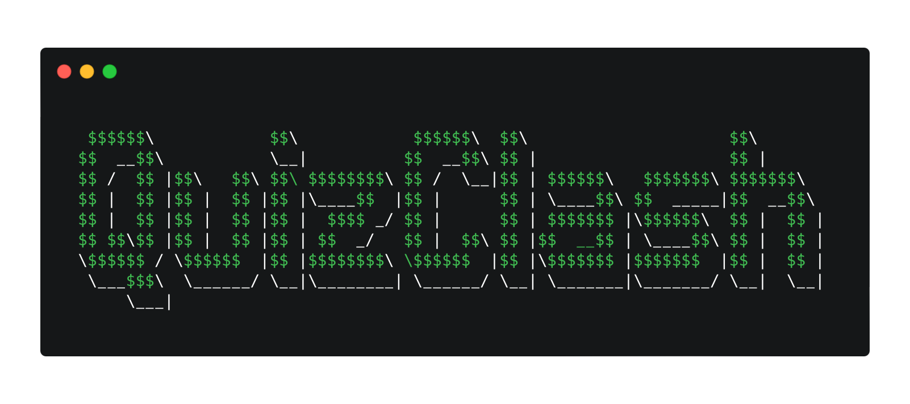

QuizClash is a CLI-based quiz game that includes multiplayer functionalities.

## Setup

### Prerequisites
- JDK >= 17
- Maven

### Installation

To make development for QuizClash, you first need to clone the repository:

```bash
git clone git@github.com:4KevR/quiz-clash.git
```

## Run application

To run the application, you have to build the jar with:

```bash
mvn clean package
```

Now you can navigate to the **plugin-main** module and execute the jar:

```bash
cd plugin-main/target/
java -jar quiz-clash-jar-with-dependencies.jar
```

> [!NOTE]
> You have to use a terminal that accepts ANSI escape codes.

### Test Report

To get the JaCoCo test report, execute the following command:

```bash
mvn -Pcoverage verify
```

You will find the reports in each module at **/target/site/jacoco/index.html**. The overall report for all modules can be found at **report/target/site/jacoco/index.html**. This report will also be published on GitHub Pages on every push on main. It can be found [here](https://4kevr.github.io/quiz-clash).
